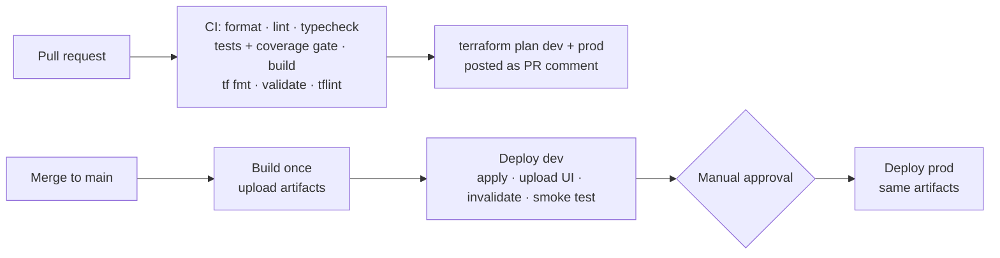

# Serverless URL Shortener

A production-style URL shortener on AWS: **CloudFront → API Gateway (HTTP API) → Lambda (TypeScript) → DynamoDB**, with a static web UI on S3. All infrastructure is defined in **Terraform** and shipped by **GitHub Actions** with keyless OIDC auth, PR plan previews, and gated multi-environment promotion.

```mermaid
flowchart LR
    U([User]) -->|HTTPS| CF[CloudFront<br/>+ CloudFront Functions]
    CF -->|/app/*| S3[(S3<br/>web UI, private via OAC)]
    CF -->|/api/*, /&#123;code&#125;| APIGW[API Gateway<br/>HTTP API<br/>throttling + access logs]
    APIGW --> L1[λ createLink]
    APIGW --> L2[λ redirect]
    APIGW --> L3[λ getLink]
    L1 -->|PutItem| DDB[(DynamoDB<br/>on-demand + TTL)]
    L2 -->|UpdateItem| DDB
    L3 -->|GetItem| DDB
    R53[Route 53 + ACM<br/>optional] -.-> CF
```



## Features

- **Shorten** any http(s) URL, with optional **custom alias** and **expiry** (1 day – 1 year)
- **302 redirects** with per-link **click counting** and last-clicked timestamp
- **Stats API** and a lightweight web UI (vanilla TypeScript + Vite, ~3 KB JS gzipped)
- Optional **custom domain** via Route 53 + ACM, toggled with one Terraform variable

## API

| Method | Path                | Description                                                 |
| ------ | ------------------- | ----------------------------------------------------------- |
| `POST` | `/api/links`        | `{ url, alias?, ttlDays? }` → `201 { code, shortUrl, ... }` |
| `GET`  | `/api/links/{code}` | Link metadata + click stats                                 |
| `GET`  | `/{code}`           | `302` to destination (counts a click)                       |
| `GET`  | `/`                 | `302` to the web app at `/app/`                             |

```bash
curl -X POST https://<domain>/api/links -H 'content-type: application/json' \
  -d '{"url":"https://example.com/very/long/path","alias":"demo","ttlDays":7}'
```

Errors are consistent JSON: `400` validation (with per-field details), `404`, `409` alias taken, `429` throttled.

## Engineering highlights

**Single-round-trip redirects.** The redirect is one DynamoDB `UpdateItem` that atomically checks that the link exists and hasn't expired, increments `clicks`, and returns the URL (`ReturnValues: ALL_NEW`). There is no read-then-write race and no second call.

**Collision-safe code generation.** Codes are 7-character base62 strings (62⁷ ≈ 3.5 trillion) drawn from `crypto.randomBytes` with rejection sampling to avoid modulo bias. Inserts use `attribute_not_exists(code)` and retry on collision. The same conditional write makes custom aliases race-free (`409` on conflict).

**Expiry done right.** `expiresAt` is DynamoDB's TTL attribute, so expired items are deleted for free. TTL deletion can lag by hours, so expiry is _also_ enforced in the redirect's condition expression and the stats read.

**One domain, three origins.** CloudFront routes `/app/*` to a private S3 bucket (Origin Access Control, TLS-only bucket policy), and everything else to API Gateway with caching disabled. The `/app` behaviors use exact patterns, so a code like `apple12` isn't captured. Two CloudFront Functions run at the edge. One rewrites directory indexes. The other passes the viewer's `Host` as `x-forwarded-host`: API Gateway rejects foreign `Host` headers, so this is how the API returns short URLs on whatever domain the visitor used.

**Least privilege everywhere.**

- Each Lambda has its own role that grants exactly one DynamoDB action (`PutItem` / `UpdateItem` / `GetItem`) on one table, and writes only to its own log group.
- Lambda invoke permissions are scoped per route, not per API.
- CI uses GitHub OIDC with no stored AWS keys. PRs assume a **read-only** plan role. Only jobs bound to a GitHub **environment** can assume the deploy role, and that role's writes are limited to resources carrying the project prefix.

**Abuse controls.** API Gateway throttles the whole stage, with a stricter limit on `POST /api/links`. Validation (Zod) rejects non-http schemes like `javascript:`, URLs over 2048 characters, reserved aliases, and links back to the shortener itself (redirect loops).

**Cheap and fast.** The Lambdas run on arm64/Graviton with esbuild-minified ESM bundles, and the AWS SDK is excluded from the bundle because it ships in the runtime. DynamoDB is on-demand and CloudFront uses `PriceClass_100`. At portfolio traffic the whole stack stays within the AWS free tier.

**Observability.** Handlers write structured JSON logs (queryable field by field in CloudWatch Logs Insights). API Gateway writes JSON access logs with latency breakdowns, and Lambdas have X-Ray active tracing. All log groups have retention set.

## CI/CD



- **Build once, promote everywhere.** Prod receives the exact artifacts that passed in dev.
- **Smoke tests after every deploy** go through CloudFront end to end: create a link, follow the redirect, verify the click was counted, and check the 404 and 400 paths.
- **Remote state** lives in versioned, encrypted S3 with S3-native locking (`use_lockfile`), so there's no DynamoDB lock table.
- **Coverage gate** at 90% lines. Dependabot keeps npm, Actions and Terraform providers current.

## Repository layout

```
services/api/          Lambda handlers (TypeScript), esbuild bundling, Vitest tests
  src/handlers/        createLink · redirect · getLink
  src/lib/             repository (DynamoDB), validation (Zod), codes, http, logging
web/                   Frontend (Vite + TypeScript), served under /app/
infra/
  bootstrap/           One-time: state bucket, GitHub OIDC, plan/deploy IAM roles
  modules/
    url_shortener/     Composition: DynamoDB + functions + API + CDN
    lambda_function/   Reusable function + role + log group
    http_api/          HTTP API, routes, throttling, access logs
    cdn/               CloudFront, S3/OAC, edge functions, optional domain
  envs/dev, envs/prod  Thin roots with per-environment settings
scripts/smoke-test.sh  Post-deploy end-to-end checks
.github/workflows/     ci.yml · deploy.yml · _deploy.yml (reusable)
```

## Getting started

### Local development

```bash
npm install
npm test            # API unit tests (DynamoDB mocked) with coverage
npm run build       # Lambda bundles -> services/api/dist, UI -> web/dist
npm run dev -w web  # UI at http://localhost:5173/app/
```

To make the local UI call a deployed stack, create `web/.env.local` with `VITE_API_ORIGIN=https://<your-distribution>.cloudfront.net`.

### First deployment

Prerequisites: an AWS account, Terraform ≥ 1.10, and a GitHub repository.

1. **Bootstrap (once, with admin credentials):**
   ```bash
   cd infra/bootstrap
   terraform init
   terraform apply -var="github_repository=<owner>/<repo>"
   ```
2. **Configure GitHub:**
   - Add repository **variables**: `AWS_REGION`, `TF_STATE_BUCKET`, `AWS_PLAN_ROLE_ARN` and `AWS_DEPLOY_ROLE_ARN`. The last three come from the bootstrap outputs.
   - Create **environments** `dev` and `prod`, and add _required reviewers_ to `prod`.
3. **Push to `main`.** The pipeline deploys dev, runs the smoke tests, then waits for your approval before deploying prod.

### Custom domain (optional)

Set `domain_name` and `hosted_zone_id` in `infra/envs/<env>/terraform.tfvars`. Terraform then issues and DNS-validates an ACM certificate in us-east-1, attaches it to CloudFront, and creates the A/AAAA alias records.

## Possible extensions

- Async click analytics (DynamoDB Streams → aggregator Lambda: referrers, countries, time series)
- Authenticated link management (Cognito) with per-user link lists via a GSI
- AWS WAF on CloudFront (managed rule groups, rate-based rules)
- CloudWatch dashboard and alarms (5xx rate, p99 latency, throttles) with SNS alerts
- Block direct access to the `execute-api` endpoint so all traffic goes through CloudFront
